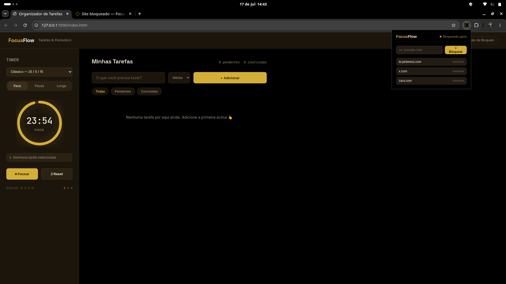

# 🍅 FocusFlow

Aplicativo web de organização de tarefas com timer Pomodoro integrado, acompanhado de uma **extensão de navegador** que bloqueia sites distrativos automaticamente enquanto você está em modo de foco.

> Projeto pessoal desenvolvido para treinar organização de estado em JavaScript puro (sem frameworks), arquitetura modular de front-end, e Chrome Extensions (Manifest V3).


*(Substitua por um print real do app rodando antes de subir pro GitHub)*

---

## ✨ Funcionalidades

**App de tarefas**
- Adicionar, concluir e excluir tarefas
- Prioridade por tarefa (baixa / média / alta), com indicação visual
- Filtro por tarefas pendentes / concluídas / todas
- Persistência local (`localStorage`) — os dados não se perdem ao fechar o navegador
- Vincular uma tarefa como "em foco" no timer, exibindo o nome dela no sidebar

**Timer Pomodoro**
- Três presets de método de estudo: Clássico (25/5/15), 52/17 e 90/20
- Troca automática de modo (foco → pausa → foco...) ao zerar o tempo
- Contador de ciclos até a pausa longa
- Notificações do navegador ao concluir um ciclo
- Anel de progresso animado, com efeito de brilho ("halo") durante o foco

**Extensão de bloqueio (Chrome)**
- Lista de sites bloqueados, cadastrada e editada pelo próprio usuário
- Sincroniza em tempo real com o timer do app: bloqueia automaticamente quando o modo Foco está rodando, libera na pausa
- Tela de bloqueio personalizada ao tentar acessar um site da lista durante o foco

---

## 🛠️ Tecnologias

- **HTML, CSS e JavaScript puro** (sem frameworks nem bibliotecas de UI)
- **Chrome Extensions API** — Manifest V3, `declarativeNetRequest`, `chrome.storage`, `chrome.runtime` (mensageria entre content script e service worker)
- **Web Notifications API**
- **localStorage** para persistência de dados

---

## 📁 Estrutura do projeto

```
organizador-de-tarefas/
├── index.html
├── css/
│   ├── reset.css
│   ├── variables.css      # design tokens (cores, tipografia, espaçamento)
│   ├── layout.css
│   ├── timer.css
│   ├── tasks.css
│   └── responsive.css
├── js/
│   ├── utils.js            # helpers puros (seletores, formatação de tempo, IDs)
│   ├── storage.js          # única camada que fala com o localStorage
│   ├── state.js            # estado central das tarefas (padrão pub/sub)
│   ├── render.js            # desenha a tela a partir do estado
│   ├── tasks.js             # eventos de UI das tarefas
│   ├── timer.js             # lógica do Pomodoro + ponte com a extensão
│   ├── notifications.js     # Web Notifications API
│   └── app.js               # ponto de entrada, liga tudo
└── extensao-bloqueio/
    ├── manifest.json
    ├── background.js        # service worker: mantém a blocklist e as regras de rede
    ├── content-script.js     # ponte entre a página do app e a extensão
    ├── popup.html / popup.js / popup.css
    ├── blocked.html / blocked.css
    └── icons/
```

---

## ▶️ Como rodar

O app **precisa** ser aberto via servidor local (não funciona abrindo o `index.html` direto com duplo clique), porque a extensão só se conecta em URLs `http://localhost` ou `http://127.0.0.1`.

**Opção 1 — VSCode (Live Server)**
1. Instale a extensão *Live Server*
2. Botão direito em `index.html` → "Open with Live Server"

**Opção 2 — Python**
```bash
python -m http.server 8000
```
Depois acesse `http://localhost:8000`.

### Carregando a extensão de bloqueio

1. Abra `chrome://extensions`
2. Ative o **Modo de desenvolvedor** (canto superior direito)
3. Clique em **"Carregar sem compactação"** e selecione a pasta `extensao-bloqueio/`
4. Abra o popup da extensão e cadastre um site (ex: `youtube.com`)
5. No app, selecione o preset desejado e clique em **Iniciar** no modo Foco
6. Tente acessar o site cadastrado — ele será redirecionado para a tela de bloqueio até a pausa começar

> ⚠️ A extensão usa APIs específicas do Chromium (Manifest V3), portanto funciona no **Google Chrome, Brave ou Edge** — não é compatível com navegadores baseados em Firefox (como o Zen Browser).

---

## 🧠 Desafios e aprendizados

- **Comunicação entre contextos isolados**: o maior desafio técnico foi conectar o app web (rodando na aba) com a extensão (rodando em um processo separado). A solução foi usar `CustomEvent` no `window` para o app "avisar" o content script, que repassa via `chrome.runtime.sendMessage` para o service worker.
- **Separação de responsabilidades em JS puro**: sem um framework, a organização em módulos (`state`, `render`, `tasks`, `timer`) com um padrão simples de pub/sub (`subscribe`/`notify`) foi essencial para manter o código previsível conforme as features cresciam.
- **Depuração de extensões**: aprendi a usar os consoles separados do Chrome (da página, do service worker e do popup) para rastrear onde uma mensagem estava se perdendo entre os três contextos.

## 🚧 Possíveis melhorias futuras

- Suporte a Firefox/Zen Browser (adaptando para `browser.*` API)
- Técnica 20-5-20 como lembrete complementar de pausa visual
- Estatísticas de produtividade (ciclos concluídos por dia/semana)
- Exportar/importar tarefas

---

## 👤 Autor

Desenvolvido por Artur como projeto de portfólio, aplicando conceitos de JavaScript modular, persistência local e extensões de navegador.